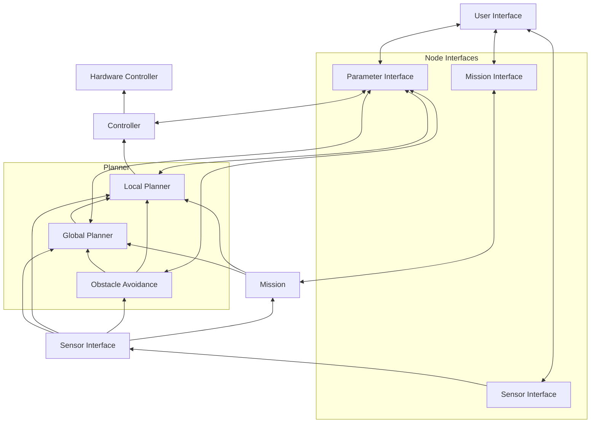

```mermaid
flowchart BT;
	
	subgraph Planner
		GP[Global Planner]
		LP[Local Planner]
		OA[Obstacle Avoidance]
	end
	SF["Sensor Interface"]
	Mission
	Controller
	HC[Hardware Controller]
	subgraph Node Interfaces	
		PI[Parameter Interface]
		MI[Mission Interface]
		SI[Sensor Interface]
	end
	UI[User Interface]

	SI --> SF
	
	SF --> GP
	SF --> LP
	SF --> OA
	SF --> Mission
	GP --> LP
	LP --> Controller
	OA --> GP
	OA --> LP 
	Mission --> GP
	Mission --> LP


	Mission <--> MI
	OA <--> PI
	LP <--> PI
	GP <--> PI
	Controller <--> PI

	Controller --> HC
	

	PI <--> UI
	MI <--> UI
	SI <--> UI
	
	
```